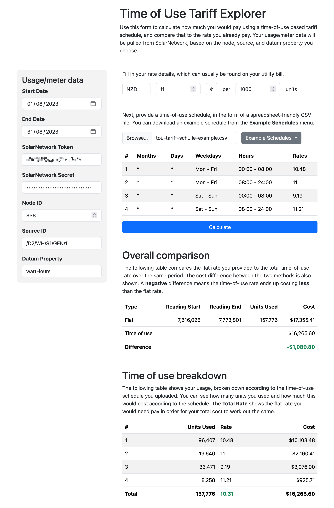

# SolarNetwork Time of Use Tariff Explorer

This project is a little web app to help you compare flat-rate tariff
pricing against time-of-use tariff pricing. You can try it out here:

<https://go.solarnetwork.net/tou-explorer/>



# Built with Nifty ToU

This app is built with the [Nifty ToU](https://github.com/SolarNetwork/nifty-tou) library.

# Building from source

To build yourself, clone or download this repository. You need to have
Node 16+ installed. Then:

```sh
# initialize dependencies
npm ci

# run development live server on http://localhost:8080
npm run dev

# build for production
npm run build
```

Running the `build` script will generate the application into the `dist/` directory.
